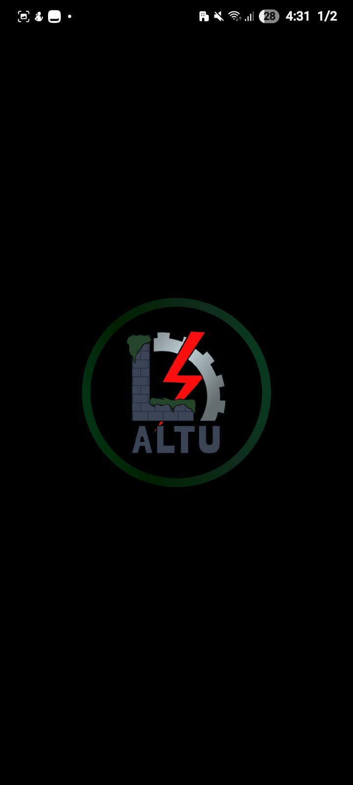
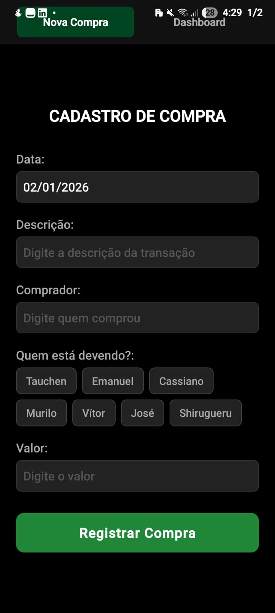

# LoduAltu
<p align="center">
  
  
</p>


LoduAltu é uma aplicação mobile desenvolvida utilizando **React Native** com o auxílio da plataforma **Expo**, tendo como objetivo **[descrever aqui o propósito do aplicativo]**. O projeto possui caráter acadêmico e foi desenvolvido com foco na aplicação prática de conceitos relacionados ao desenvolvimento de aplicações móveis multiplataforma.

---

## 1. Objetivo do Projeto

O objetivo principal deste projeto é desenvolver uma aplicação mobile capaz de **[descrever o problema ou necessidade atendida]**, utilizando tecnologias modernas que permitam reutilização de código, rápida prototipação e compatibilidade com dispositivos Android por meio do ambiente Expo Go.

---

## 2. Funcionalidades

- Implementação das funcionalidades centrais da aplicação  
- Interface gráfica desenvolvida com componentes React Native  
- Execução da aplicação via **Expo Go**, sem necessidade de build nativo  
- Estrutura baseada em componentes reutilizáveis  
- Código organizado visando legibilidade, manutenção e extensibilidade  

---

## 3. Tecnologias Utilizadas

As seguintes tecnologias e ferramentas foram empregadas no desenvolvimento do projeto:

- React Native  
- Expo / Expo Go  
- JavaScript  
- Node.js  
- Visual Studio Code (IDE)  
- Android (ambiente de execução)

---

## 4. Metodologia de Desenvolvimento

O desenvolvimento seguiu uma abordagem incremental, com testes contínuos durante a implementação. A utilização do Expo permitiu rápida validação das funcionalidades diretamente em dispositivos físicos, facilitando o processo de depuração e ajustes na interface e na lógica da aplicação.

---

## 5. Estrutura do Projeto

O projeto adota a organização típica de aplicações React Native, baseada em:

- Componentes funcionais
- Separação entre lógica de negócio e interface
- Uso de arquivos de estilo para padronização visual
- Gerenciamento de dependências via npm ou yarn

---

## 6. Instalação e Execução

### 6.1 Pré-requisitos

- Node.js instalado  
- Expo Go instalado no dispositivo Android  

---

### 6.2 Execução do Projeto

```bash
git clone https://github.com/MartinesEmanuel/LoduAltu
cd LoduAltu
npm install
npx expo start
```

1. Abra o aplicativo **Expo Go** no dispositivo Android.
2. Escaneie o QR Code exibido no terminal ou no navegador.
3. Aguarde o carregamento da aplicação.

---

## 7. Testes

Os testes foram realizados de forma manual, consistindo na execução das funcionalidades da aplicação e verificação de:

- Comportamento esperado das telas
- Respostas às interações do usuário
- Estabilidade durante o uso

---

## 8. Considerações Finais

O projeto LoduAltu possui finalidade acadêmica e educacional, servindo como base para estudos futuros em desenvolvimento mobile com React Native e Expo. A aplicação pode ser expandida com a adição de novas funcionalidades, melhorias na interface e integração com serviços externos.

---

## 9. Autor

**EmanueL Martins**  
Graduando em Ciência da Computação — UNIFEI  
GitHub: https://github.com/MartinesEmanuel
